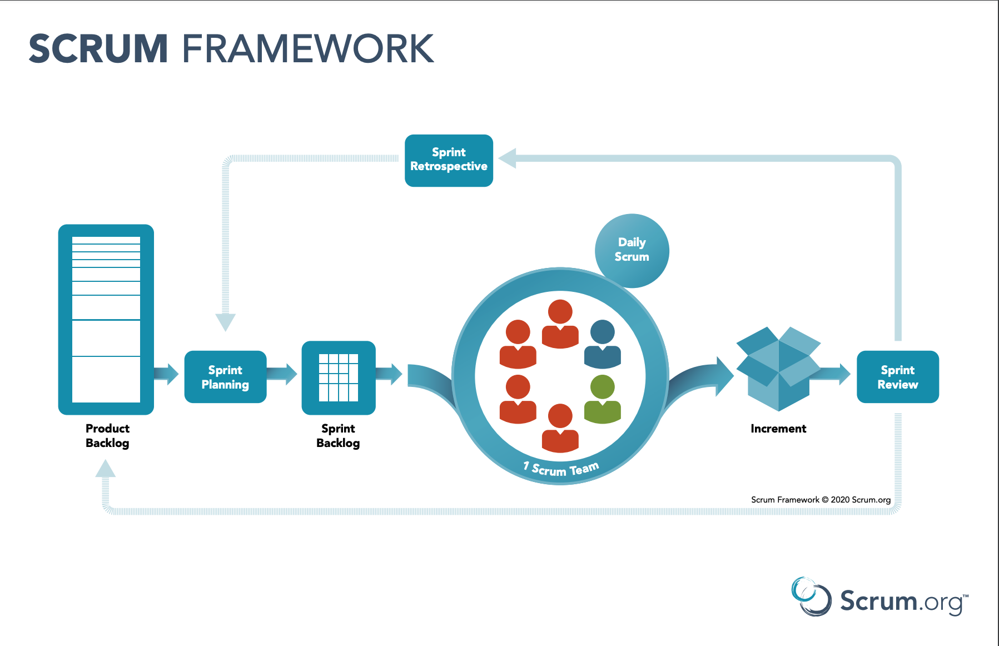
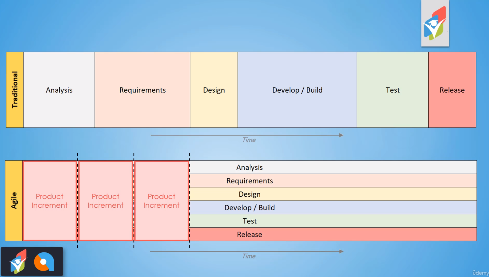
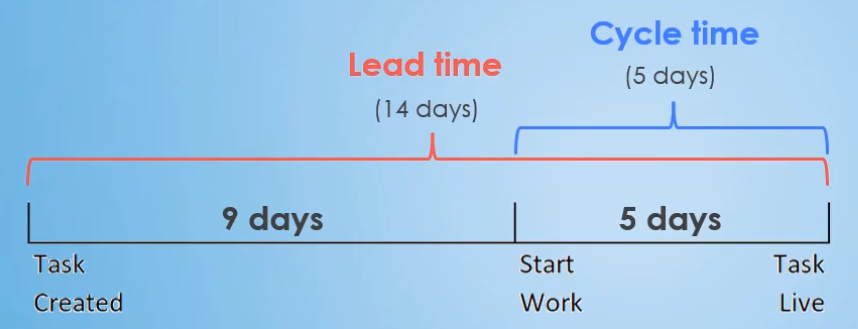

  
Table of Contents

  <ol>
  <li><a href="#agile">Agile</a></li>
  <li><a href="#scrum">Scrum</a></li>
  <li><a href="#estimating-in-agile">Estimating in Agile</a></li>
  <li><a href="#other-agile-roles">Other Agile Roles</a></li>
  <li><a href="#scrum---digging-deeper">Scrum - Digging Deeper</a></li>
  <li><a href="#kanban">Kanban</a></li>
  <li><a href="#scrumban">Scrumban</a></li>
  </ol>

&nbsp;

## About The Project

- Agile Fundamentals: Including Scrum and Kanban - 2021
- Master Agile principles, values, approaches, & mindset to help organizations make changes faster and with less expense.
- [Website - BA Guide](thebaguide.com)
- [Website - Agile Coach](https://www.theagilecoach.com/)
- [LinkedIn - Jeremy Aschenbrenner](https://www.linkedin.com/in/jeremyaschenbrenner)
- [LinkedIn - Vivek Khattri](https://www.linkedin.com/in/vivekkhattri)
- [LinkedIn - Pabitra Khanal](https://www.linkedin.com/in/pabitrakhanal/)

&nbsp;

## Notes

&nbsp;

### Agile

- [Agile Manifesto - 4 Values:](https://agilemanifesto.org/)
  - Individuals and interactions over processes and tools
  - Working software over comprehensive documentation
  - Customer collaboration over contract negotiation
  - Responding to change over following a plan
- [Agile Manifesto - 12 Agile Principles:](https://agilemanifesto.org/principles.html)
  1. Our highest priority is to satisfy the customer through early and continuous delivery of valuable software.
  2. Welcome changing requirements, even late in development. Agile processes harness change for the customer's competitive advantage.
  3. Deliver working software frequently, from a couple of weeks to a couple of months, with a preference to the shorter timescale.
  4. Business people and developers must work together daily throughout the project.
  5. Build projects around motivated individuals. Give them the environment and support they need, and trust them to get the job done.
  6. The most efficient and effective method of conveying information to and within a development team is face-to-face conversation.
  7. Working software is the primary measure of progress.
  8. Agile processes promote sustainable development. The sponsors, developers, and users should be able to maintain a constant pace indefinitely.
  9. Continuous attention to technical excellence and good design enhances agility.
  10. Simplicity--the art of maximizing the amount of work not done--is essential.
  11. The best architectures, requirements, and designs emerge from self-organizing teams.
  12. At regular intervals, the team reflects on how to become more effective, then tunes and adjusts its behavior accordingly.

&nbsp;

> <b>Rumela: </b>I would like to know, since Agile talks about continuous delivery of the working software for end user feedback. What should be the ideal duration of software delivery during the process. Should it be weekly or every two weeks or less?

> <b>The BA Guide: </b>For me, I say 2-week sprints tend to work the best. That way it provides enough time to get things accomplished, while also delivering value to the organization multiple times a month. I've also seen a 3-week sprint work well for more complex projects.

&nbsp;

---

&nbsp;

> <b>Tarek: </b> Fast Delivery AND be responsive even in late phases
>
> I am transforming from Techie to management, and I found this amazing course. I might still have a Developer mind, so please forgive my non-flexible mind of set. If we just read about these principle, they are the heaven. however, if we put them in real world situation, we MUST do trade-off on one or an another. For example, how you ask your developers to be ready to change even in late in development, and in the same time, you are expecting from them to deliver as fast as possible? Please let me know how I can deal with this kind of situation.

> <b>The BA Guide: </b> Yes, the principles are easy in thought, but a challenge to apply in practice. The delivery value faster doesn't mean the developer needs to deliver faster, but instead, the team is able to release valuable updates to the business on an iterative basis (every 2-4 weeks traditionally).
>
> As well, it is known that changes will take time to adjust. It isn't expected the developer be able to make changes magically without impact. That principle is ultimately stating that we shouldn't be pushing back on the business and making them feel bad for wanting the change - we should be open to it.

&nbsp;

---

&nbsp;

> <b>priyanka: </b>Sprint Extension
>
> What if team can not able to finish the items in the sprint ? can it be extended (for how long it needs to be extended?)

> <b>The BA Guide: </b> Under most circumstances, if not all, a Sprint should not be extended. Items that are not completed in one Sprint should (most often) flow into and be worked on in the next Sprint.

&nbsp;

---

&nbsp;

> <b>Deepashree : </b>Agile Principle #4
>
> As part of Agile Principle #4, where you described as the stake holders/ Clients and development team come together and collaborate. Where you described as removing the bottleneck in the process or the middlemen. Wouldn't that then mean a BA being the middlemen is more of a additional piece into this not necessarily required for this kind of model work, as its more of an additional Layer?

> <b>The BA Guide: </b>Correct, there is no official Business Analyst role as part of Agile. They do this because there may not always be a need for a BA.

&nbsp;

---

&nbsp;

> <b>Radim: </b>Half Agile - half Waterfall
>
> Most Agile coaches always speak of software development. But what if you want to build a house? In my opinion you can successfully use half Agile and half Waterfall project management. When building a house, you need to build a basement first, then ground floor, then first floor and then the roof. And your customers will not see a value until the house is finished and they can move in, which is going to be months or even a year down the road.
>
> So building a house is done in phases and this is strength of Waterfall. However within each phase, you can be Agile. E.g. when working with architect on a design of the house. And you can make small changes to the plans, for example changing the roof, for as long as the roof is not built.

> <b>The BA Guide: </b>I too have seen companies try to employ a hybrid Agile and Waterfall methodology/approach. And while I think this can work, it often is not Agile. Companies that do this usually want the benefits of going Agile but don't want the major changes it will cause to their projects and potentially their company structure. So they do this hybrid approach to say "we are Agile now" without the investment and pains.
>
> The issue with doing it this way is you are still stuck in that phased approach mentality. You are imagining building a house like foundation, then framing, then walls, then roof, etc. You don't receive the value until the house is completely done. And for a house, while you do need to have some things done first (foundation, framing, and roof), an Agile approach would likely have you finishing rooms one by one. Then you could be receiving the value of that one room while another room is finished. And this is with us only breaking up by rooms. We could also break the features of the room down as well. Maybe our first iteration in a bedroom is walls up over the framing and a bed. Second iteration adds paint to the walls and carpet to the floor. Third one adds some lighting and a fan. Etc.
>
> So, while a house is traditional done in a phased approach, Agile could be used to help generate the value faster. For example, if you were homeless and you had to choose between these two approaches, Agile would likely be the clear winner since the value (shelter from the elements) would be received sooner than with the full Waterfall house.

&nbsp;

---

&nbsp;

> <b>Hossam: </b>How does agile handle welcoming change and loose contracts ?!
>
> Change is going to happen, but it comes with time, cost or quality penalties. If we are to welcome "Any Change" from the customer, the plans will no longer make sense, as they will always be temporary obsolete documents, and you would exhaust your project budget or resources without proper change control over the project. How does agile handle this challenge especially when we have a loose contract with the customer?

> <b>The BA Guide: </b>Very common question. So the first thing is Agile does not have the level of pre-planning that your Traditional approaches (Waterfall) have. When changes happen, they are the updated needs are documented in a unit of work (usually a User Story) and then that item is prioritized based on its importance in comparison to the other items in the Backlog.
>
> If a change would happen that would affect a User Story that is in a Backlog, you simply make adjustments to that User Story (assuming it is not currently being worked). In regards to the contract with a customer. This gets a bit trickier as there has to be a level of trust. In most Agile projects, there is not a set outcome. Instead, there is a vision and a contract that provides budgeting to get them as close to that vision as possible, while adjusting for all the changes in business along the way.
>
> For example, in Agile the contract may state vaguely for the team to "deliver a CRM system that appropriates houses customers, contacts and sales data." The customer would budget for a certain number of iterations. At the end of each iteration the value would be delivered via new features and functionality. As the contract nears an end, the customer can decide if there is value in purchasing additional iterations to continue to evolve and update the system.

&nbsp;

---

&nbsp;

### Scrum

- [What is Scrum](https://www.scrum.org/resources/what-is-scrum)
- Sprints
- Scrum Master
- Product Owner
- Development Team

&nbsp;

&nbsp;

> <b>Adrian: </b>Review vs Retrospective

> <b>The BA Guide: </b> Sprint Reviews allows the team to show off the work they have done for the week. This is often done with live demos and an explanation of the changes directly to the customer. This allows for immediate feedback and requested changes. Lessons are learned here on what the customer wants.
>
> Sprint Retrospectives encourage the team to look inward at their processes, skills, and other internal team items to make more efficient, enhance, or adjust in some way. This promotes a learning environment, so the team will continually improve. This isn't really a celebration. That comes at the end of the project. Lessons are learned here for individual and team improvement.

&nbsp;

---

&nbsp;

> <b>Alejandra: </b>Retrospective meeting
>
> How much time do you think a retrospective meeting should take? I know it depends on the group, amount of people, among others, but considering the daily takes 15 min each day, the sprint review should take about....? Same question goes to creating the sprint. How much time should be spent?

> <b>Bruno: </b>In the Scrum guide they talk about maximum amount for time:
>
> - Sprint planning: max 8 hours for 1 month sprint
> - Review: max 4 hours for 1 month sprint
> - Retrospective: max 3 hours for 1 month sprint
>
> It may help you make some estimations at first, and after some sprints, you will be aware of the scrum team speed, figuring the time you need for the events, and plan accordingly. That's just my opinion.

&nbsp;

---

&nbsp;

> <b>Trishul: </b>Scrum Master vs Project Manager

> <b>The BA Guide: </b>Typically, the Project Manager is in charge of making sure the project completes successfully - on time and within budget. They help ensure the right resources are engaged, keep the project moving forward, and communicate the status to those who need to know. But in Agile, since the team is self-organizing (meaning they self-assign work), don't have a set schedule they are trying to achieve, and are responsible to the whole team, there isn't a need for the supervision of a Project Manager.
>
> The Scrum Master is somewhat similar to the role of a Project Manager (meaning they are there to help things run smoothly), but they do this in a much different fashion. Instead of dictating tasks and holding people to deadlines, they remove impediments and ensure the team follows the best practices of Scrum. The Scrum Master is often referred to as the servant-leader to the team. They are doing whatever they can to enable the team to be successful and complete as much work as they can each Sprint.

> <b>Trishul: </b>Thank you, another question on roles then would be as a BA would I be able to be a Scrum Master on a project where I am assigned to be the BA as well? Or should the Scrum Master always be someone who is not part of the Dev team?

> <b>The BA Guide: </b>Yes, the Scrum Master could be part of the Dev team. I've heard of this being successful for some organizations and I don't see anything within The Scrum Guide that would inhibit this.

&nbsp;

---

&nbsp;

> <b>Varma Amankumar: </b>Scrum master
>
> Is it necessary that the scrum master should be an IT or Programming person? or he can be any person who can implement scrum values

> <b>The BA Guide: </b>I definitely don't think the Scrum Master needs to be from a technology background. In fact, the best Scrum Masters I worked with were ex-Business Managers. They knew how to solve problems and remove roadblocks. They just needed to become experts on Scrum.

&nbsp;

---

&nbsp;

> <b>Varma Amankumar: </b>Whats the difference between BA and PO in roles and responsibilities?

> <b>The BA Guide: </b>The BA and PO are close in roles. The key to remember from Agile Scrum, there is no official "Business Analyst" role. This means those duties need to apply to another role, in this case, the Product Owner. This is why you see so much overlap.
>
> Now how each organization uses POs and BAs in their Agile teams will vary drastically, but most often the BA is a right-hand-person to the PO in helping them understand and document the needs of the business. The BA is often the specialist in requirements, so it makes sense for most instances.
>
> However, some organizations have BA's less involved with the PO and more assisting the team in completing and testing the various Sprint Backlog items. It really depends on the project, the industry, and the culture of the organization.

&nbsp;

---

&nbsp;

> <b>Chithra B: </b>BUSINESS ANALYST VS PRODUCT OWNER

> I'm working as a business analyst for an organization that develops mobile apps. My work involves writing user stories and adding to JIRA, making wireframes, coordinate with UI/UX team for designing the app, developer support, making flow diagrams, FSDs, user manuals etc. From the lecture on various scrum roles, I get to know that my role as a BA, does the job of the product owner as well, as you said pseudo PO.
>
> Can you explain how the role of BA is different from a Product owner? Does it vary based on the organization and the way they implement Scrum methodology? Do you think the role I'm doing now as a BA will be totally different if go to another organization, will I have to start from scratch?

> <b>The BA Guide: </b>The BA and PO are close in roles. The key to remember from Agile Scrum, there is no official "Business Analyst" role. This means those duties need to apply to another role, in this case, the Product Owner. This is why you see so much overlap.
>
> Now how each organization uses PO's and BA's in their Agile teams will vary drastically, but what you are doing is what I see most often. Basically, the BA is a right-hand-person to the PO in helping them understand and document the needs of the business. The BA is often the specialist in requirements, so it makes sense for most instances. However, with that being said, some organizations have BA's less involved with the PO and more assisting the team in completing and testing the various Sprint Backlog items. It really depends on the project, the industry, and the culture of the organization.
>
> Regardless, the skills and responsibilities you are learning and getting familiar with now will be hugely beneficial to you should you move to another company or department.

&nbsp;

---

&nbsp;

> <b>Kelly: </b>What is the difference between project manager and product owner?

> <b>The BA Guide: </b>Sure can. At a high-level... The Project Manager is there to ensure the project stays within scope, quality, and budget. They are not responsible for making sure it is valuable to the organization. The Product Owner is there to help the team understand the vision of what the business needs and is in charge of making sure the value is realized by the solution (that it solves the problem).

&nbsp;

---

&nbsp;

> <b>Anita </b>I really enjoy the way you explain the different roles and responsibilities in Scrum. However I am slightly confused about the split of the responsibilities between the PO and the BA.
>
> As per the Scrum guide: "The Product Owner is the sole person responsible for managing the Product Backlog. Product Backlog management includes:
>
> - Clearly expressing Product Backlog items;
> - Ordering the items in the Product Backlog to best achieve goals and missions;
> - Optimizing the value of the work the Development Team performs;
> - Ensuring that the Product Backlog is visible, transparent, and clear to all, and shows what the Scrum Team will work on next; and
> - Ensuring the Development Team understands items in the Product Backlog to the level needed."
>
> One of the most important backlog item is a user story which - as you also mentioned - describes a piece of functionality written in a certain fashion. Based on the description of the role of a PO, writing user stories is the responsibility of the PO. If we think about splitting techniques such as happy/alternate path analysis or applying the CRUD rule or SPIDR etc., we can see that writing a good user story requires a lot of different skills that are originally associated with the skillset of a BA. So my understanding is that a PO is doing a lot of classical BA related tasks in order to own the product backlog successfully.
>
> My question is where would you draw the line between the responsibilities of the PO and the BA? Does a Scrum team even need a separate person to do business analysis work? I also can imagine that the business analysis can be split between a PO and a supporting UX researcher, therefore no separate BA person is needed. (Just as a side note: I am not saying that someone who worked as a BA in a waterfall model has no value to add in a Scrum team, I would just transfer that person from the BA role to the PO or UX role depending on their personal interest.) I am really interested in your view and thank you for your answer in advance.

> <b>The BA Guide: </b>This is a great question Anita. I will start out by saying, it depends. Different organizations handle it in various ways, but let me share what I feel is the most common, and I'm sure Vivek will chime in with his thoughts as well.
>
> The Product Owner generally does create the initial user story (who, what and why), but very often that user story needs to be groomed further and acceptance criteria needs to be added even before the user story is ready for estimation, let alone ready to be worked (based on whatever the team's definition of ready is). This is usually where someone with business analysis skills steps in to help massage and enhance that user story.
>
> That Business Analyst (or like person) usually elicits additional details from the Product Owner about the business need and, in fact, may even talk to some of the business subject matter experts/users to get perspective and context about the requested change. They would then update the user story as needed and validate with the Product Owner that it creates the business value and solves the business need they had identified.
>
> In regards to your second question, does Agile really need someone with a title of 'Business Analyst' in the team? While I don't think it completely necessary to have someone with a 'Business Analyst' title on the team, you do need someone that can perform business analysis work. So regardless of their title ('Product Owner', 'UX Designer', etc.), they need to know how to elicit requirements, write great user stories, guide design, etc. And from my experience, those that came from a Business Analyst background succeed the best in those roles. So in the end, I think the 'Business Analyst' is just as necessary, if not even more needed in Agile methodologies.

&nbsp;

---

&nbsp;

> <b>Shruti : </b>Why we need BA when we have PO

> <b>The BA Guide: </b>While a Product Owner could play the part of the Business Analyst, there are usually two inherit problems:
>
> 1. <b>Simply not enough time</b> - PO's are extremely busy doing their normal tasks. With adding in the duties of a Business Analyst (conducting detailed requirement elicitation sessions, analyzing options, etc), they would quickly be overwhelmed. In fact, many PO's that I have worked with lean on BA's to help with the normal PO duties as well (let alone the BA specific duties) because there is simply too much for them to do.
>
> 2. <b>Don't have the right skill set</b> - Depending what a PO's background is, they may not have the specialized skill set they need to act as a successful BA. This could be cured with training, but then point #1 jumps back into play.

&nbsp;

---

&nbsp;

> <b>Christian : </b>Should every request go through the PO?
>
> I currently work as a ScrumMaster for a team that works on a project already in production.
>
> We receive demands from several areas, including: customer support, projects, application security and other development teams. Currently the PO analyzes and prioritizes only requests that are considered to be improvements or new features; these then become stories and the team selects these demands in the sprint planning.
>
> All other requests that do not fit this category go directly to the me and are not accounted for in the sprint planning. I am currently the person responsible to schedule meetings with other areas, order these demands according to the urgency and distribute them to the dev team members.
>
> I feel I am also being the PO in this scenario. Is my feeling correct? Should all requests go through the PO? What could go wrong in this situation?

> <b>Vivek & Pabitra : </b>Anything related to the product should come from the PO, the PO holds the vision for the product and is responsible for the success of the PO. I guess I am wondering what kind of work are they having you do or is the work that's passed to you ends up taking the time of the developers even though it's not counted in the planning sessions?

> <b>Christian : </b>Hi! Thanks for the response. Maybe I have to clarify a few things.
>
> Currently we use Jira as a tool to manage our backlog. The PO only creates and manages tickets for new features or improvements. But issues can also be created by several other actors, like customer support, projects etc. These ones typically refer to bugs being found.
>
> My question is: should the PO be aware of those tickets and be responsible for prioritizing them?

> <b>The BA Guide: </b>I would say 100% yes. I've seen a few times where organizations allow other project team members and sometimes outside stakeholders to enter Product Backlog Items. But the Product Owner always has the say as to when the work is completed. He or she will order it based on the value it provides. Then the person that entered it can help explain (lobby) why it is very important to them to hopefully have it ranked higher in the Product Backlog.

&nbsp;

---

&nbsp;

> <b>Anonymized: </b>How to drive daily stand meeting if team size is of 25 people?
>
> In my team, there are around 25 people. When we started the daily stand, we used to ask each and every persons daily status. Because of this the stand up meetings were running long (more than 15 minutes). So we avoided to take each and everyones status, instead we just ask about the impediments and if there are any impediments, we just discussed those in stand up. Is it the correct way of driving the daily stand? Please suggest for any improvements.

> <b>Pierre: </b>I don't see any issue regarding how you are running the standup. But I think that 25 peoples is too much for 1 scrum team. You have better to split that in smallest teams of 5-10 peoples (in your case, maybe 3 teams). Easiest to manage and you can split your backlog per team.

> <b>The BA Guide: </b>I agree with Pierre. Break the team up into smaller teams if you can. If not, it is a matter of 'doing what you have to do' in order to make the Stand Up Meeting work for your team.

&nbsp;

---

&nbsp;

> <b>Pratik: </b>Who will schedule daily standup, Sprint planning, Sprint Review, Sprint Retrospective meetings?

> <b>William Chacon: </b>Usually the Scrum Master. But the team could agree something different. However the Scrum Master must ensure that the team have these meetings and reach the purpose of each.

> <b>The BA Guide: </b>William is right on. Thanks for providing your insight!

&nbsp;

---

&nbsp;

> <b>Manoj: </b>By the time sprint review, all the development work done is moved to prod? Demo is done in prod?

> <b>The BA Guide: </b>This really isn't dictated by Scrum and I've seen organizations go both ways.
>
> Most will use the Sprint Review to demo what has been completed (in a testing environment), gain feedback, adjust Product Backlog items to account for the feedback, and unofficially validate all is good to move to Prod as is (any changes to be addressed with further Product Backlog items).
>
> Other organizations will have moved everything to Prod and will use the Sprint Review to gain real user feedback based on them using the updates. Since increments can really be released at any time (most organizations wait until the end of the Sprint, but they don't have to), there can't be a hard and fast rule on whether this Sprint Review should be done before the move to Prod.

&nbsp;

---

&nbsp;

> <b>Ankur: </b>How do I build temporal intuition around over-commitment / under-commitment of the development team?
>
> As a new product owner or a scrum master, knowing that the development team is staying honest to committing to work seems to be a valuable data point. How do you suggest I should build this intuition. Are there any reference sample/ typical projects that are broken down into tasks (along with the typical time required to finish the tasks)?

> <b>The BA Guide: </b>It really isn't the role of the Product Manager or the Scrum Master to validate estimates. While they can use the estimates to root out risks and uncertainties, there really shouldn't be someone looking over the shoulder of the team. If the estimate is well higher or lower than expected, have a conversation to ensure it is understood correctly and get some clarity as to why there is a discrepancy. Those details and that learning will help you in future Sprints and projects when similar tasks arise.
>
> In regards to how you understand how long something takes, it really takes experience. Each task that is estimated and worked is an opportunity for you and the team to learn. Learn what risks jumped out of nowhere, learn what nuances added effort to the task, learn what acceptance criteria weren't as clear, etc.
>
> Experience and lessons learned from previous tasks are your greatest teachers.

&nbsp;

---

&nbsp;

> <b>Karla: </b>Is Intra-sprint re-prioritizing done?
>
> If there so happens to be a change in priority, might this impact an individual sprint, and when might that decision be made? Or is it more typical that a sprint - once planned - will be completed, and the adjustment will impact the following sprint?

> <b>The BA Guide: </b>Prioritization of how and when User Stories are completed within the Sprint is entirely up to the team. If completing them in an order different than what was originally expected would provide some type of benefit or value, absolutely they should make that adjustment.
>
> If items not selected to the Sprint Backlog escalate in priority and need to be done right away, you can handle it two ways. One, you put it as the top priority for next Sprint. Or, you could swap this high priority User Story with a similarly sized User Story that had been committed to the Sprint. Essentially deprioritizing the one User Story back to the Product Backlog, where it can be put into priority order.
>
> Simply adding the escalated User Story to the Sprint Backlog without removing anything ("we'll find a way to fit this in") is a sure-fire way to fail your Sprint and impact the delivery of the Increment.

&nbsp;

---

&nbsp;

> <b>Anonymized: </b>Contract and billing
>
> Since requirements and the final product itself may vary a lot from the first prospecting meetings with the client. How do you draft a contract that is not based on the first intended requirements? Clients usually want to know exactly what they are paying for and when are they going to receive it?

> <b>The BA Guide: </b>If the vendor is using an adaptive approach (such as Scrum) then the customer has to understand they are paying for the iterations to help get them to a successful vision. In the contract it will often define what the vision is expected to be and how long it is anticipated it will take to get there, but there would also be verbiage to say that due to an adaptive approach, that could change.
>
> In my experience, adaptive approaches in consulting are usually done best when there is already a relationship and trust between the vendor and the client. For new clients, it might be best to do smaller scope (so shorter) Waterfall projects.

&nbsp;

---

&nbsp;

> <b>Fernando: </b>What should happen if to figure out risks of a certain story somebody needs to check out the code already made?
>
> Some stories might need to be done on top of already existing code, which the team might not be fully aware of it or maybe forgot some details. Should they look at the code during the sprint planning? Should they move this risky story to the next sprint and meanwhile they will check the code? Should they decide to remove it during the in case of the code is not what they expected?v

> <b>The BA Guide: </b>Fernando, I would approach this challenge by forming a team agreement of Defination of Ready (DOR). One way to have a discussion with the team and PO is to talk about the readiness of the story and decide as a team on how to move forward. Personally, I would bring this up on a backlog grooming session or the sprint planning meeting.

&nbsp;

---

&nbsp;

> <b>Leila: </b>Who does the backlog grooming (aka backlog refinement/ story time)?

> <b>The BA Guide: </b>It is the Product Owner and Development Team (Business Analyst) grooming the stories. More often than not, from what I've seen, it is the Business Analyst grooming the stories when other team members (including the Product Owner) identify additional needs, details, or clarifications.

&nbsp;

---

&nbsp;

> <b>Minh-Tuan: </b>How often, how long, and when do you do backlog grooming?

> <b>Vivek & Pabitra : </b>Minh, backlog grooming happens through out the sprint really as a pre-sprint planning meeting. It really depends on kind of the work the team has and how much of time team want to dedicate on grooming their user stories. Personally, I have had 2 hours of backlog grooming session for a 2 weeks sprint. Also, one can do 2 separate session (of 1 hour each) for backlog grooming. Main thing you want to remember is that the goal of this session is to have the stores a little more elaborated for the sprint planning meeting. Hope this helps.

&nbsp;

---

&nbsp;

> <b>Anish: </b>Can we do Sprint Review and Retrospective in a single meeting

> <b>The BA Guide: </b>You could, but there would need to be an audience change. Stakeholders are nearly always involved in the Sprint Review (as they are the main audience), but they are not often included in the Sprint Retrospective. The Retrospective is for the Scrum Team to become more efficient and make changes to make their Sprint outcomes (Increments) more successful.

&nbsp;

---

&nbsp;

> <b>Fábio André Veloso: </b>Tasks and User Stories
>
> On a industrial environment dealing with maintenance of a product where the goal is to complete the maintenance can the user stories be the tasks or set of tasks that need to be performed to achieve the goal? In my case the goal is clear but the tasks can change because depends how bad the product is, so I think that an agile approach can be helpful instead of planning from the beginning because we have a lot of uncertainty until the reception of the product.

> <b>Vivek & Pabitra: </b>Hi Fabio, yes you can user stories for the tasks in your case. Seems like you can really use Kanban if the tasks are changing.
>
> Unlike Scrum, in Kanban you dont have to plan for the sprint. Kanban has a pull approach where you pull from from the ready story and manage the story from start to implementation of that story/task. Also, very important to keep WIP (work in progress) limit in place for you team.

&nbsp;

---

&nbsp;

> <b>Yonattan Wieli Anggoro: </b>You said that product owner define and verify acceptance criteria. Is it ok for PO to do both create and verify it's own creation?

> <b>The BA Guide: </b>Most common sequence:
>
> - PO creates User Story
> - PO and/or Dev Team creates Acceptance Criteria
> - Dev Team solves for User Story
> - PO verifies it meets the Acceptance Criteria

&nbsp;

---

&nbsp;

> <b>Anonymized: </b>Writing Great User Stories - Independent
>
> So in order to write good user stories we should follow the technique of INVEST. The point Independent: Tells that when we are writing a user story we don't have any dependence on any user story and the team can get it to done without other user stories. In situation that we have a very complex feature that has any many dependencies this point cannot work, right? Or are there other other ways of doing it? Thanks

> <b>The BA Guide: </b>INVEST is considered best practice, but there are times when not all of the items will apply. For example, there will be requirements that are dependent on others. And breaking that dependency would take more time or effort than what is gained (if it is possible at all). In those cases, you should view that dependency as a risk and track it as one until the dependency is removed (the requirement is fulfilled).

&nbsp;

---

&nbsp;

> <b>Chester: </b>Acronym INVEST as a guideline in writing Great User Stories. As Independent and Small are part of the INVEST guideline in writing great user story, meaning, as much as possible, we should avoid big user stories that requires splitting and dependent on another user story?

> <b>The BA Guide: </b>Correct. You want to keep the User Stories to a size that can be analyzed, completed, tested, and ready for release in one iteration. Also correct. Avoid having dependencies between User Stories if at all possible. You want to be able to treat each story as a separate entity and prioritize it based on importance, not simply because a future story is dependent on it.

&nbsp;

---

&nbsp;

> <b>Leia: </b>How is the process of writing a user story when a QA is involved? If there is a QA and that person finds bugs and issues and has to report them... Do they write a user story or how is the process for letting the P.O know about this issue/bug?

> <b>The BA Guide: </b>Each organization does it a bit different method:
>
> - Some do user stories into the backlog
> - Some have their QA log the bugs into a tracker, which is where certain resources would pick up the bug and determine if it is a quick fix or not
>
> But the common theme is always 'face-to-face conversations are the most effective method of conveying information.' Every organization I worked with that was running Agile had their QA people talk with the PO frequently about various bugs they've found. Sometimes they even interrupt the PO from meetings to show them something they deem critical.

&nbsp;

---

&nbsp;

> <b>Munaf: </b>Product backlog estimation
>
> 1. This is being an Agile framework, will we have all stories documented ready at the beginning of the project to estimate the product backlog?
> 2. Considering user stories can be refined, additional information could be added, and elaborated, do we have to reestimate the product backlog?
> 3. My understanding is, we estimate the user stories identified for the current sprint. Is that not true?

> <b>The BA Guide: </b>
>
> 1. You definitely won't. Which makes it challenging to understand when the project should end.
> 2. Yes! Anytime you are making changes to the Product Backlog Item, it should be reestimated. It is for that fact that I usually only have (approximately) half of the Product Backlog Items estimated in my Product Backlog.
> 3. You can do it this way but you lose the ability to prioritized based on size, as well as it makes it harder to maximize your team's velocity (because you don't know how many points you are committing to until after they are identified for the current sprint). For these reasons, I don't often recommend this.

&nbsp;

---

&nbsp;

> <b>Sowjanya: </b>Who will prepare this work agreement?Is this same for the whole organization or differs with each team?

> <b>The BA Guide: </b>Scrum Master is the one who facilitates the Working Agreement session for the team if the team is using Scrum Framework. If the team is not using using Scrum framework, sometimes we have seen Agile Coach or Team facilitator, facilitate and prepare the working agreement. Also, yes. There are some companies and teams who do it differently or don't even bother to create a working agreement in the first place.

&nbsp;

---

&nbsp;

> <b>Devaiah Pattada: </b>Work Agreement-
>
> Work Agreement: As per the current topic it states how team members collective agrees to the working style.
>
> In case Scrum master is on leave Who will drive the current sprint ? or in case where team members are on leave how would it be handled? Is Availability of Team members is taken into consideration during Sprint planning?

> <b>Vivek & Pabitra: </b>If the scrum master is on leave, the Product owner can drive the sprint planning. SM and PO would chat probably prior to being on leave about how they want to go about it. And yes, if a team member would be on vacation, the capacity or the velocity of the team would be reduced based on that. The SM should find out if someone is going to be on vacation each sprint and adjust the work accordingly. Hope that helps.

&nbsp;

---

&nbsp;

> <b>Working Agreement: </b>Is this like a project charter? The one that states the goal of the project, when meetings should take place, how issues should be escalated within the team, how communication should take place within the team, etc.

> <b>The BA Guide: </b>While they have a few similarities, the Project Charter is an overview of the project, while the Working Agreement is a collaboration tool for an Agile team. The Working Agreement is helping to shape how the team works together by setting forth some rules and expectations.

&nbsp;

---

&nbsp;

### Estimating in Agile

- Used to estimate
  1. Elicited Information
  2. Past Experiences
  3. Documentation

|                Agile                |              Non-Agile              |
| :---------------------------------: | :---------------------------------: |
|   Relative estimate (Size: S,M,L)   |          Absolute estimate          |
|        Placed into a bucket         | Updates usually cause major imparts |
| Updates usually cause minor impacts |          Measured in days           |

- Estimating in Agile
  1. Provides estimated duration
  2. Drives out clarification questions
  3. Highlights complex and high risk tasks

&nbsp;

- Categorized into groupings:
  - Big/Uncertain/Small (BUS)
  - Each user story is compared to others and assigned to a group
    - 'Big' stories should be broken up if possible
    - 'Uncertain' stories need to be groomed or broken up
  - Fibonaci Sequence: 1,2,3,5,8,21
  - Each user story is compared to others and assigned 'Story Points'
    - Larger stories should be broken up if possible
    - Number of points per sprint is the team's velocity

&nbsp;

---

&nbsp;

> <b>Társila: </b>How to estimate in agile considering it would be your first sprint?
>
> In lecture 41. Estimating in Agile, we learn that to estimate in agile, we use a relative way, it means, comparing the time and effort spent in other same features and their sizes (small, medium, large) in that same project. But my doubt is: How do we estimate or categorize (in size S, M or L) a feature to be developed considering it would be your first sprint or iteration? Cause you wouldn't have any parameters to compare.

> <b>Vivek & Pabitra: </b>You would apply the empirical mindset here. Developers come from some expertise on how to long/effort/complexity of certain user story might be. Even in the current sprint, you would want them to identify a user story that would take less effort, ideally figure out your 1 or 2 and size rest based on that.

&nbsp;

---

&nbsp;

> <b>Kapil: </b>Estimating in agile
>
> We often work on the projects where the timeline is fixed but execution is in agile mode. That means, pushing the incomplete story to next sprint will have similar impact as it would in a non-agile project.

> <b>The BA Guide: </b>When companies do things like this I call it Agile-ish. It's not quite Agile, but they use the Agile structure to take advantage of some of the benefits. To help you with your scenario, I have some questions. Are building the product incrementally and only releasing it at the end to the customer? Or are you building and releasing periodically? I guess I am confused when you say "the timeline is fixed". The timeline for the project? The Sprint length? How does pushing the incomplete story to the next Sprint impact your project?

> <b>Kapil: </b>Thank you for your response !! We are building the product incrementally, but it is not contained within it's small boundary. It has to interact with more than 40 other applications. So, the first release in production happens in about 6 months.
>
> When I say the timeline is fixed, I would like to give an example: Organization ABC decides to replace their legacy application and invite a number of IT service providers to bid for the project. Mindset here is that "build the most of the requirements, in least amount of time, in the best possible way (architecture, design and code)". The selected IT service provider is committed to the "fixed timeline".
>
> Often times the estimation of this fixed timeline goes wrong. Problems start appearing when the new requirements are discovered, or some unforeseen issue occurs. It is easy to push that story to the next sprint if it is continuous development in a silo, but not so easy when we are dealing with an enterprise level application which needs to be live before holiday peak starts.
>
> Another point is about documentation: It is said that we don't document in Agile. What happens when the IT service provider leaves after completing the work? Organization ABC will not have any way to maintain, or train their own associates on this new enterprise application. Maintaining stories in Jira is good, but where do I go when I have to understand what this application does, how it interacts with other applications?
>
> Sometimes I, as a product manager not only have to keep the product vision clear, but I have to also get into design of the solution. It is just the reality.

> <b>The BA Guide: </b>Okay, so basically you are working Iteratively to build out a product by a certain date. There are three things in products that are variable - cost, time, scope. Unfortunately, in your scenario it seems like they want all these to be static... which just doesn't work in a changing (and dare I say) Agile environment.
>
> The customer wants a specific product scope, with a fixed cost, on a fixed timeline. This is nearly always going to cause a problem. The only way this works is if the scope truly stays the same and nothing new is learned, which is near impossible - just as those working in Waterfall approaches. This is the challenge with Agile-ish approaches. Some organizations like to try and take the good of Agile (delivering value faster, ability to learn and adapt), without taking the cons of Agile (not knowing exactly what the end result of a budgeted amount will include).
>
> So with pointing out the challenge, I think one way to fix this is to change the culture as to how the customer is communicated with. And this may be hard due to the procurement and selection process that is happening. If the expectations can't change, just being diligent as an Agile team to point out when changes are occurring to cost, scope, or time so it can be understood the potential impact of that change.
>
> In regards to documentation, Agile does not say 'no documentation'. Instead, it says the end result should be a solution, not a packet of paper that explains how the solution works, a design, or something else. Products are only successful when you get them into the customer's hands and they get value from them. A requirements packet doesn't help the customer. But, with saying that, if some type of sketch, quick design, visual model, or other documentation would aid in the discovery of the user's needs or would aid the Development Team in creating a successful solution to the problem, then they should absolutely be created and included. I hope this helps!

> <b>Kapil: </b>Thank you again for your response. Yes, it is a challenge we face every day. For documentation, we still do our best to document the designs in confluence or other repository, which could be utilized later.

&nbsp;

---

&nbsp;

> <b>Paulo Jorge: </b>How do you know if it can be done within the sprint?

> <b>Vivek & Pabitra: </b>Generally, it is really hard to estimate how much exactly a task/story will take to complete. It's relative who is estimating and one needs to consider lot of different factors.
>
> So, the folks on agile community have experimented with the Fibonacci series and have found it's helpful to use story points for an estimate and these estimates should be taken loosely. One main benefit of this kind of estimation is that no-none is counting hours and it is taken as an estimate (that means estimates can be wrong sometimes). After a few sprints of working together, usually, team members get better at estimating the right complexity of a story or how many stories they can complete in a sprint. For the teams that keep on overestimating sprint after sprint, they can bring this issue on a team retrospective and discuss how they can get better at estimating.
>
> I want to bring your focus on understanding variables or sources of variation (if you really want to help teams better at estimating). When helping your team estimate, you can ask them to keep these variances in mind (because they can majorly impact your estimates. A few of these variables are
>
> 1. steps/handoffs
> 2. system dependencies
> 3. context switching
> 4. blockers
> 5. rework
> 6. accidental complication
> 7. waiting for availability
> 8. collaboration policy of the team
> 9. Stages of the team or Team Composition (skill sets of the team)
>
>    ....etc
>
> So, in my opinion, if you were to really keep all of these variables in mind, estimation can become really difficult. One of my agile mentor and friend (Matt Philips) hit me with these questions to ponder thinking about estimation :-)
>
> 1. In what context would estimates bring value, and what are we willing to do about it when they don’t? – Woody Zuill
> 2. How much time do we want to invest in this (estimation)? – Matt Wynne
> 3. What can you do to maximize value and reduce risk in planning and delivery? – Vasco Duarte
> 4. Can we build a minimal set of functionality and then learn what else we must build (instead of getting the estimates right)?
> 5. What actions would be different based on an estimate?

&nbsp;

---

&nbsp;

> <b>Donald: </b>How does one budget for inevitable changes when the customer is used to total project pricing?

> <b>The BA Guide: </b>Regardless if you are working a project Waterfall, Agile, or another approach, you should always have an estimated budget associated with the project. Otherwise, it would be difficult to say that it will be valuable and a good return on investment. For Agile, estimates are often determined based on a guess on how many Sprints it will take to achieve enough functionality that will bring value, plus any costs any anticipated costs - subscriptions, hardware, software licenses, etc.

&nbsp;

---

&nbsp;

> <b>Steve: </b>When estimating is it common practice to estimate the entire backlog before commencing ?
>
> We are about to embark on a large project and have a sizeable backlog which has been T-Shirt sized. However in order to forecast duration I feel that we need to move to the Fibonacci story point approach and then use our average velocity after a period of sprints as a baseline to establish a forecast duration. Is this the correct and common practice approach to take to forecast duration. At what point would you do the estimation process to get to story points. I understand this would be refined during Sprint Planning but I think it would be valuable to ascertain a baseline for the project as a whole before that point. Many Thanks for any feedback you can share.

> <b>The BA Guide: </b>Interesting scenario and I'd love to get Vivek and/or Pabitra's advice as well, but here is my take. The standard typically says to do a quick estimate of all currently identified tasks and then to divide by velocity to get the length. But personally, I don't feel this works very well. There are so many changes and new requirements identified (hence using Agile) that doing this exercise ends up wasting time at the start of the project when value could begin to be created. As well, especially in a large project, it will take a significant amount of time to create the user stories to a level that they can be estimated. (the point of Agile is to adapt so taking this type of approach feels like a Waterfall hangover)
>
> Instead, what I would typically suggest is to take the top X priority stories (whatever is deemed "must-have"), estimate those, and divide by velocity to determine the minimum number of sprints. Then add a few sprint buffer for maintenance, support, and currently unidentified "top priorities". This can then be used to understand the shortest length the project will take. The max length depends on how much value is being returned on the items that are being created further down the priority list. This could be done both with Fibonacci or with T-shirt. For T-shirt you could assign numbers to each size to help you determine velocity - small =1, med = 3, large = 5... I hope this helps!

&nbsp;

---

&nbsp;

> <b>Konstantina: </b>Setting up the estimation for the stories

> I wonder if there is a technique for the way a team begins to estimates every story, no matter what kind of the 3 techniques presented is going to use.
>
> For instance, let's assume that we are going to use T-Shirt technique, and we have 40 stories for estimation. How do we begin, since we are talking for relevant estimating between stories? If we grab the first story we have no information about the other 39 stories so as to compare. If we take the 3 top priority stories and compare them we could have an idea.. maybe the 1st is S, the 2nd Mand the 3rd XL.. and then the 4th story might be larger than the 3rd. That might means that the 3rd story should be estimated as L and the 4th as XL.
>
> If we follow this way of thinking, for every new story we might need to reevaluate all the previous ones. Is there any less time consuming way to do this job?

> <b>The BA Guide: </b>At the beginning of a project, the estimates are usually going to be less accurate than later once you have some Sprints under your belt. Because of that, don't get too hung up on making a perfect estimate. Simply give a logical guess and adjust the estimate as necessary once you have more relative stories you can compare to.
>
> If this sounds hard, think of it this way. Let's say you are judging size - is an elephant a 1, 2, 3, 5, 8, or 16? Let's say you estimate it at an 8. And then the next three stories are about the size of a skyscraper. Those would likely be 16 and we would need to adjust the elephant to maybe a 3. It is all relative and can be adjusted as needed. The estimations will take shape after a few Sprints.

&nbsp;

---

&nbsp;

### Other Agile Roles

- Role Triangle
  - <b>Product Owner: </b> Brings business vision
    - Including what and why
  - <b>Development Team: </b>Defines technical vision
    - Self-organizing
    - Decides how
  - <b>Scrum Master: </b>Serant leader
    - Facilitates scrum events
    - Removes impediments

&nbsp;

---

&nbsp;

- <b>Project Sponsor: </b>
  1. Approves project and budget
  2. Provides the big picture view
  3. Helps shape the project need and outcomes
  4. Ensures project stays aligned to company objectives
  5. Participates in Sprint Reviews (and other feedback demos)
  6. Recognizes the team for quality work
  7. Encourages cross-team/cross-department collboaration
  8. Provides perspective on product impact and use

&nbsp;

---

&nbsp;

- <b>Business Leaders: </b>
  1. Enables access to necessary business resources
  2. Provides the needs of management
  3. Ensures user story results are creatin value for the business
  4. Escalates resolution of identified impediments (as needed)
  5. Participates in Sprint Reviews (and other feedback demos)
  6. Encourages cross-team/cross-department collboaration
  7. Acknowledges team successes and provides support

&nbsp;

---

&nbsp;

- <b>Technology Leaders: </b>
  1. Hires team mebers with the right skillset!
  2. Gives up control - empowers, trusts, and supports the team
  3. Enables access to necessary technology resources
  4. Escalates resolution to identified impediments (as needed)
  5. Participates in Sprint Reviews (and other feedback demos)
  6. Encourages cross-team/cross-department collboaration
  7. Acknowledges team successes and resolves team conflicts
  8. Ensures solution is aligned with organizational standards

&nbsp;

---

&nbsp;

- Agile Detractors - Leadership
  1. Demands mid-sprint changes
  2. Hijacks ceremonies to discuss 'high-priority' topics
  3. Not available for demos
     - Then requests changes at the Sprint Review
  4. Discourages communication with other teams
  5. Removes or changes avilable resources mid-project
  6. Doesn't value the Agile mindset
     - People over processes
     - Communication over documentation

&nbsp;

---

&nbsp;

- <b>Subject Matter Expert/ Senior User: </b>
  1. Provides their needs and the needs of other users
  2. Participates in Sprint Reviews (and other feedback demos)
  3. Provides continuous feedback on product deliverables
  4. Gains and communicates feedback from other users
  5. Provides perspective and context for requirements
  6. Completes requested testing in a timely manner
  7. Ensures user storu results are used properly

&nbsp;

---

&nbsp;

- <b>Business Users: </b>
  1. Provides their needs (differentiates wants and needs)
  2. Provides perspective and context for requirements
  3. Attends feedback demos they are invited to
  4. Attends, watches, or reads training on deliverables
  5. Utilizes deliverables and gives feedback
  6. Completes requested testing in a timely manner

&nbsp;

---

&nbsp;

- <b>Agile Coach (Experienced Agile Practitioner): </b>
  1. Trains, guides and supports

&nbsp;

---

&nbsp;

> <b>Mark: </b>Daily Stand-Up Meeting Q: regarding "on and on", and "one word answer" scenarios

> <b>The BA Guide: </b>
>
> 1. Team members that went "on and on" - I would speak to them privately and run over the goal of the Daily Stand-Up. I would explain to them we don't need a full status update, but instead a quick snapshot of what you did, what you are doing, and any hurdles you are running into. Further status updates and discussions can be done in a smaller group (as needed) to help others understand specifically where you are at.
>
> 2. Team members that gave "one word answer" - For these folks I would politely prod them with the questions - what did you do yesterday, what are you working on today, and what hurdles are you running into (or expect to run into)? Doing this consistently should help them to get into the flow of the stand-up.

> <b>Mark: </b>Thank you for your feedback. Seems like really doubling down on these three questions, in a focused way, helped your conversations in these scenarios.

&nbsp;

---

&nbsp;

> <b>Sonia Gonzalez: </b>Agile detractors can really be disruptive in an agile process, which one is your practical recommendation to deal with them and avoid or diminish the issues they might cause, mentioned in the training?

> <b>The BA Guide: </b>I'd be happy to. Here are some of my thoughts:
>
> <b>Demands mid-sprint changes -</b> Explain that in Agile changes (new urgent requirements) are welcome, but they should be outlined and prioritized in the Product Backlog. Then they will be picked up and worked in an upcoming sprint (the next one if the requirement is urgent). This locking of commitments for the sprint is needed to help reduce risk and ensure the team knows the 'target' they are shooting at to complete the sprint successfully (value being produced).
>
> <b>Hijacks ceremonies -</b> Have a one-on-one conversation and explain the meaning and value of the ceremony. Mention that when high priority topics are discussed in that ceremony that the team is unable to accomplish their agenda for that ceremony. And then provide another means for high priority items to be discussed (one idea is the leader should bring up the high priority requirements to the Product Owner and allow them to disseminate those changes in the appropriate means).
>
> <b>Not available for demos -</b> Have a discussion to find out why. Explain the value in attending the demos. As necessary, make adjustments to help them attend; different times, offer remote call-in/video access, etc. Another (last resort) option would be to record the demo and provide it to the leader after-the-fact. The challenge here is they 1) may not watch it -or- 2) if they have feedback, this has to be redistributed to the team outside of the demo.
>
> I hope this helps!

&nbsp;

---

&nbsp;

> <b>Carey: </b>Types of Resources
>
> I am curious about examples of resources in the second-to-last bullet. The audio seems to refer to human resources only. Is that the primary type of resource removal which is a detractor? What are some examples of removing resources mid-project?

> <b>The BA Guide: </b>As you mentioned Carey, yes, these resources could also be non-human. These could include access to meeting rooms, equipment, necessary software/tools, etc.
>
> Here are some hypothetical examples of resources being removed:
>
> - Architect was promised to the project, but after only two days of assisting, they have been pulled off to help with a critical issue - unknown when they will be available again
>   Meeting room was booked for four months to be a common meeting and working place for the project, but leadership booked a client visit in there for a week
>   Four QA testers were supposed to be available for three weeks to help the project, but leadership has changed this to two QA testers and only for two weeks as they have other projects these testers need to be engaged in
>
> I hope this helps to shed some light!

&nbsp;

---

&nbsp;

### Scrum - Digging Deeper

- Team Velocity
- Burndown Chart
- Burnup Chart: Reflects points that were decreased or increased

&nbsp;

---

&nbsp;

|     |      Scrum Term      |                                                              |
| :-: | :------------------: | :----------------------------------------------------------: |
| 1.  |    Burn Up Chart     |  Compares total user stories versus completed user stories   |
| 2.  |    Burndown Chart    |   Visual aid that shows trending of user stories completed   |
| 3.  |      Commitment      |   Value: Give 100% effort to achieve project team’s goals    |
| 4.  |       Courage        |     Value: Do the right thing and work on tough problems     |
| 5.  |    Daily Standup     | Discussion of yesterday’s progress, today’s plan, and issues |
| 6.  |  Definition of Done  |      Common understanding of when something is complete      |
| 7.  | Definition of Ready  |       User story contains enough details to be worked        |
| 8.  |        Focus         |     Value: Complete the right work based on sprint goals     |
| 9.  |       Openness       |    Value: Discuss the work and challenges of the project     |
| 10. |  Product Increment   |      Vertical slice of a potentially shippable product       |
| 11. |   Product Backlog    |   Prioritized list of user stories that grows and changes    |
| 12. |    Product Owner     |         Tasked with understanding the product vision         |
| 13. |       Respect        |        Value: Treat everyone as a capable team member        |
| 14. |   Development Team   |      Self-organizing, cross-functional group of people       |
| 15. |     Scrum Master     |            Servant leader that removes roadblocks            |
| 16. |        Sprint        |            Is a time-box - a specific set of time            |
| 17. |    Sprint Backlog    |        Committed user stories for upcoming iteration         |
| 18. |   Sprint Planning    |   Discussion and commitment for the next iteration’s work    |
| 19. | Sprint Retrospective |      Share lessons learned from the previous iteration       |
| 20. |    Sprint Review     |      Meeting to demo progress made during the iteration      |
| 21. |    Team Velocity     |   Number of story points that are completed per iteration    |
| 22. |      User Story      |  Simple description of a feature from a user’s perspective   |
| 23. |   Work in Progress   |            Work that is currently being completed            |
| 24. |  Working Agreement   |   Team-created list of rules, expectations, and procedures   |

&nbsp;

---

&nbsp;

> <b>Rick: </b>Burnout and Obstacles
>
> 1. Agile has a continuous rapid pace with hard deadlines similar to a production line. A key difference is that tasks require thought and analysis versus the same repetitive action. How does agile address any stress/burnout in teams? Or perhaps this is a "who" question.
> 2. If there is a sprint and a hard deadline, and you lose a half-day with a software update or other technical obstacle, how is this addressed?

> <b>The BA Guide: </b>Great questions and I'd be happy to help.
>
> 1. The "fast pace" isn't always true. While some companies try to ramp up their Agile teams and have them operating at break-neck speeds, I think the most successful are ones who take their time. Agile in itself is made to produce value fast, there is no need to be rushing around trying to fix and create things. The team should focus on an obtainable goal each Sprint and then work to make it happen, learning a bit more each day and iteration.
>
> 2. Any obstacles related to the team need to have a Product Backlog Item and it needs to be accepted into a Sprint. Let's say the team has already planned their Sprint and then, out of the blue, something comes up that needs to be done right away. The team would use their Agile processes to pivot by talking to the Product Owner and making tradeoffs as to what can slide back into the Product Backlog that had been committed. Ultimately, as the team picks up work for the Sprint that wasn't planned on, other planned work needs to be uncommitted and put back into the Product Backlog for a future Sprint (usually the next if still a priority).

&nbsp;

---

&nbsp;

> <b>Oyinlola: </b>After how many sprints can a team conclude on what their velocity is?

> <b>Vivek & Pabitra: </b>I would say after 3-5 sprints.

&nbsp;

---

&nbsp;

> <b>Jay: </b>Burndown Story Points at Sprint 0
>
> How would the team know how many story points were needed for the overall 'project' if at the beginning, many of the user stories haven't been estimated?

> <b>Vivek & Pabitra: </b>It would be hard to estimate story points for the overall project. That is why Agile leaders recommend the backlog to ready for two sprints ahead. When you have first two sprints of user stories ready and the team start on that work, and the product owner would work with business to have another two sprint's work ready as the team is working on already defined stories.

&nbsp;

---

&nbsp;

> <b>Yash: </b>Who decides the user story points ? Is this Scrum Master or a coordination of all the development team members ?

> <b>The BA Guide: </b>The Dev team members. The Product Owner is not involved in the estimating. The PO may point out an estimate that seems "way off" to ensure it is being understood correctly, but the PO should not be swaying the team to change estimates.

> <b>Dharan: </b>What is the role of scrum master during estimations? Also how does the dev members decides the story point of a particular user story? if the dev is fresher and have less knowledge on how to decide the story points who will be helping him in deciding the story points? and is story point equal to number of days?

> <b>Vivek & Pabitra: </b>
>
> 1. The role of an SM during the estimation is it facilitates the session, educates the team on what to consider when estimating, and helps them come to an agreement on a number that the whole team feels comfortable with.
>
> 2. I would read more on the relative estimation, but it's all through experimentation and learning, the team's arent going to be able to estimate closely right away but as they do more and more, they should be able to estimate close enough. When a new team member is on the team, they can rely on the existing team members to help them understand the user story better and estimate overall.
>
> 3. Story point doesn't equal the number of days. It's all based on effort and effort is calculated based on effort = risk + complexity + uncertainty.

&nbsp;

---

&nbsp;

> <b>Amit : </b>Burn up charts
> In order to plot the starting (first) point on a Burn Up chart, we must know how many sprints (and for that matter, how many total story points) will comprise a project. What if the scrum team has visibility of story points only for the current (or at best, the next sprint) but not for the entire project and has not yet estimated the story points for all the user stories in the Product backlog?
>
> Or should we do this?- Have the estimates ready for ALL story points before the start of the very first sprint and then keep on dynamically adjust the total story points of the project as and when the product backlog itself keeps on evolving over time. Please help clarify this doubt.

> <b>The BA Guide: </b>That is one of the challenges with the Burn-Up chart. Backlogs are changed, adjusted, and added to. Plus, many of the items not near the top likely don't have an estimate yet.
>
> I would not suggest getting estimates for all stories ahead of time. This is not value add and those estimates will change so much. Plus, Agile is a learning process. It is okay to not have all the details at the start.
>
> For me, I would likely wait for a few Sprints to have more data to then create the Burn-Up chart with. Those few Sprints should give you a better vision of the future.
>
> Remember, in itself, the chart provides no value - other than helping with decisions. And those decisions are what drive the true value.

&nbsp;

---

&nbsp;

> <b>Tatiana: </b>Questions about applying Scrum in real world teams
>
> Hi! I have some limited experience with Scrum at work, and I have several questions that I faced:
>
> 1. How do we prioritize non-product features? For example, "update library X", "resolve an exception that sends noisy alerts to the dev team, but doesn't have an impact on users"?
>
> 2. Sometimes the team must work on several projects at the same time. For example, when we can not parallel execution on one project (e.g. 9 women can not give birth of 1 baby in 1month). How to balance these 2 (or projects)? In addition to the 2 product projects, the members have some tech (or maintenance) tasks that are common.
>
> 3. At the end of the sprint, often development is done, and we only need to wait for deployment or for QA to verify. What shall devs do in those 1-2 todays? Shall they start testing themselves?

> <b>The BA Guide: </b>I'd be happy to give you some advice.
>
> 1. This has to provide value for someone, so that value and importance have to be weighed versus the value of the other competing features for the users. In some Scrum teams, I've seen them try to include story points in each iteration that could be attributed towards "internal" types of tasks (where the value is being realized within the team, not to the users). But, in the end, it is expressing the value and importance of those features consistently to the Product Owner to help get them prioritized.
>
> 2. Best practice dictates the Scrum Team works on one product at a time. Trying to balance two or more products will always cause conflict. In these situations, I tend to recommend Scrum Teams focus X number of Sprints on one product and then switch for X number of Sprints on the other product. For example, the team may spend two Sprints on Product A and then one Sprint on Product B. Then back to two Sprints on Product A, one Sprint on Product B. Rinse and repeat, adjusting the cadence as dictated by the needs of the business and products
>
> 3. Scrum best practice states the Development Team are the ones who should be performing the testing, so yes, they absolutely should be helping. But if you have a separate QA department or testers that you pull in to help, many times Development Team members will also begin analyzing the next Sprint's potential stories, creating or updating product or procedure documentation, complete a small analysis spike (or other non-changing code work), adding more details to existing stories, prepping for the release, etc.

> <b>Tatiana: </b>Thank you for your replies! Some follow-up.
>
> 1. I see. Thank you! In your practice, in such situations, what % of SPs are going for the "internal" types of tasks?
>
> 2. My team has 4 devs. Often some of the projects we work on can not be split into 4 independent tasks that can be done in parallel because there are dependencies between the tasks. Usually, only 2 devs can work in parallel on one project. So, the 2 other devs have no product work unless we start another project in parallel. As you see, with the solution of working on the projects one by one, we come to a problem, that half of the team has no product work to do.

> <b>The BA Guide: </b>
>
> 1. It depends a lot on the product being built. I would say anywhere between 10%-25%
>
> 2. Why have them all part of one team if they cannot work concurrently?

> <b>Tatiana: </b>
>
> 2.  Because the projects come and go. We have projects that are 1-9 months long. Some projects require only 1 dev (and can't be worked in parallel), some 2, some 3 devs. So, 3 is the minimum size. Then, we are working on a big product, and we need more people to have several features going. What's would be your advice? Split on 2 teams? Decrease number of people? Or increase ppl and split between teams?

> <b>The BA Guide: </b>
>
> 2.  I understand what you mean now. So these are smaller projects that are fluctuating in size and scope. That certainly makes it a bit harder.
>
> I see three possible ways to try:
>
> <b>A.</b> Split the team into parts appropriate to the project they are working on for that set of iterations. This would also mean splitting the meetings, so the Scrum Master would get extra busy, with no real gain. The other challenge is with small projects, this is going to feel like a lot of overhead (wasted time). But if the projects are large enough, this might be the best way to go.
>
> <b>B.</b> Have multiple projects use the same Product Backlog. Use some type of color-coding or other designation so it is easy to glance and see what is being worked for each. This would solve the problem of the team being split, but could cause confusion on the projects.
>
> <b>C.</b> Move to a more Kanban type of approach where the team works as one team but only grabs items for the product they are working on. This would make predicting the release dates of features a bit more difficult.
>
> There are likely other options, but this is what comes to mind of things to play around with or consider trying.

&nbsp;

---

&nbsp;

### Kanban

- 4 Basic Principles of Kanban
  1. Start with what you do now
  2. Agree to pursue incremental change
  3. Respect current process, roles, responsibilities, titles
  4. Encourage acts of leadershiop at all levels
- General Practices of Kanban
  1. Visualize the workflow
  2. Limit work in progress (WIP)
  3. Manage flow
  4. Make policies explicit
  5. Implement feedback loops
  6. Collaborate for improvement, evolve experimentally

- Key Metrics
  - Lead time
  - Cycle time
- Kanban Swimlanes
- Steps to Get Started
  1. Visualize your work
  2. Limit work in progress (WIP)
  3. Adapt, monitor, and improve

&nbsp;

> <b>Alessandro: </b>How does Bug Fixing fits inside the Sprint?
>
> How does the Bug Fixing activity is managed in SCRUM?
>
> As part of the Sprint, in order to mark a User Story as "Done", I assume that it is also validated by the QA member of the Team, and the fixing of the bugs found during the testing are fixed as part of that Sprint, correct? What about the bugs that are eventually found later by the client as part of the UAT process? Are they transformed into Product Backlog items and prioritized accordingly?

> <b>The BA Guide: </b>As a Sprint is proceeding, yes, items are being completed (developed, tested, and made ready for release). Fixing bugs that are found within the Sprint should be all baked in as part of the effort estimate for that item.
>
> If the defect is found after the Increment has been released, then the team would create Product Backlog item to document the bug and it would be put into priority order.
>
> I often see teams that know some bugs will make it through to the release version, so they allocate a number of points each Sprint towards fixing expected bugs (because those bugs usually can't be found before the next Sprint Backlog is defined in the Sprint Planning meeting)
>
> Now if the release has a critical defect, something that is heavily constraining the business, a few team members will often switch into immediate action mode to analyze the problems and get them resolved. In many of these instances, I've seen the rest of the Sprint Team move forward with planning for and executing the next Sprint, taking into account a decreased velocity due to part of their team not being available for an unknown amount of time.

&nbsp;

---

&nbsp;

> <b>Rachel J: </b>With the Kanban board what is the best way to capture the key data to track movement in a reportable fashion?

> <b>The BA Guide: </b>Therein lies the problem. There really aren't many good ways to do this. The only idea I have is using a Fibonacci type of estimate for the tasks, then you could track the velocity of each team member. You could also track total velocity in the various stages (lists) on the Kanban board (if that would be valuable).
>
> Careful though, comparing the velocity of team members makes the velocity a key performance indicator (KPI), and then estimates for tasks will begin inflating - which in turn will cause the velocity metric to lose all its value and you are back to no reporting.

&nbsp;

---

&nbsp;

> <b>Alexandre: </b>Kanban for the implementation of brand new applications
>
> I dont see how kanban can be used for the creation as new applications because doesn´t seem to have a way to relate common cards that generates something executable in a period of time. It seems much more a way to control maintanance, support or even software enhancements. Am I wrong ?

> <b>The BA Guide: </b>It certainly is safe to say that Kanban provides much less restriction and forced standards than other approaches, but it is made in a way so you can shape it to meet your org's needs.
>
> For example, if you want the ability to better predict when things will be done, you could add estimation to your Kanban cards. This could then be used to help understand how large the tasks are and give you a better idea as to when they could be ready for release.
>
> You could also create a rolling timeframe (maybe two weeks), where the team drives to get a certain set of Kanban tasks complete before the end. This could then help with batched releasing to decrease the number of push to production calls there are (assuming you are working on software/systems).
>
> But with saying all of that, yes, Kanban is often better used for small and mature teams that are less concerned with deadlines and are more concerned with continually delivering value to their stakeholders. This likely would not work well in a large, highly corporatized organization.

&nbsp;

---

&nbsp;

> <b>Andre: </b>How can i found a good WIP Number for my team? Is this always set by the number of Developers that i have

> <b>The BA Guide: </b>A few things to keep in mind while setting WIP:
>
> This is a conversation with the team. I would discuss with the team and propose a WIP limit and gain team buy-in. Also, with the proper understanding of WIP, team can set their own WIP limit. As an Agile team facilitator, I would help team members understand the pull system and why it’s such an efficient approach to view work. Limiting WIP based on capacity (a pull system) can help work flow smoothly through the board at an optimal rate. Pushing a lot of work (or multiple user stories or tickets) into the system clogs it up. This will slows everything down and impact the flow of the team.
>
> Keep in mind that you should run up against your WIP limits regularly. If you don’t, they’re probably not low enough. The idea behind WIP limit is to build some slack time for the team so they can focus on continuous improvement, reduce technical debt, learn as a team, brainstorm on the new upcoming project, etc. The goal if for you (as a team facilitator) is to create a sustainable pace for the team.
>
> So in my opinion, a facilitator should allow the team to set the limit and have regular conversation with the team to find out if the limit is serving the team (as WIP limit is really for the team and not a limit that someone is imposing on the team)

&nbsp;

---

&nbsp;

> <b>Aristya: </b>Kanban implementation
>
> You mentioned that Kanban is a more mature framework, an overall great fit for already established teams or teams who already has some project experience under their belt. But you also mentioned that Kanban fits well for start-ups, where teams are relatively new towards each and don't have the experience necessary to gauge each team member's skills. Could you elaborate a little on that?

> <b>The BA Guide: </b>Sure can. Kanban creates a loose framework that you can delivery value in, but it is not very prescriptive. Meaning, they don't enforce many rules. Instead they require a visual tool (a Kanban board) and a some basic best practices, allowing the organization to customize the other elements based on their needs and what would best help them deliver value.
>
> So, if the organization is larger, with more stakeholders and moving parts, Kanban should really only be used by mature teams. They've delivered value. They understand what it takes. While teams without much experience would likely fail without a structured framework and rules to follow.
>
> If the organization is small, such as a startup, Kanban can also be amazing. Most very small organizations don't need a detailed process defined. They instead need to be nimble and agile to meet the ever changing needs of their customers. The non-prescriptive Kanban process can provide them that core framework, without forcing them to adapt to various rules and procedures.

&nbsp;

---

&nbsp;

### Scrumban

- Overview
  - Visualize workflow with a Kanban board
  - Utilizes daily scrum
  - Work is pulled, rather than assigned
  - Strict work in progress (WIP) limits
  - Project team roles not clearly specified
  - Specialized team members

&nbsp;

---

&nbsp;

- To timebox or not to timebox?
  - Continuous Flow
    - Fluid movement of work - no timeboxes
    - Pull items into Doing baed on team capacity
    - Plane at a certain number of To Do items
    - Lead and cycle time are the key metrics
    - | To Do | Doing | Done |
  - Timebox
    - Utilizes sprints (1-4 weeks)
    - Iteration planning, reviews, and retrospectives
    - Uses Ready status to organize work items
    - Uses lead and cycle time or burndown charts
    - | Backlog | Ready | Doing | Done |

&nbsp;

---

&nbsp;

- Triage and Feature Freeze
  - Used as the project deadline is approaching
  - Team identifies most important features not yet done
  - Remainder of work items are frozen
  - Focuses the team's energy on finishing critical tasks
- Who is the target organization?
  - Any organization could use Scrumban as their approach, but it is often most successful with organizations that are a bit more mature in having successful outcomes when using Agile.

&nbsp;

---

&nbsp;

> <b>Agung Triarta: </b>SCRUM BOARD
>
> Hi, I have some questions about the Scrum
>
> In some of the companies, they implement the Scrum method (includes all the ceremonies, terms, and artifacts) but they also use what they called "Scrum Board".
>
> The Scrum board content is similar to the kanban method which is To-do, In progress, Done. The content is a collection of tasks that needed to finish for completing the user stores using a sticky note. They also record which member is doing that task and how many hours that each member have to spend to finish that task. (one task can be done by more than 1 member)
>
> Based on the course explanation I think that the company is using the scrumban method instead of the Scrum.
> But when I have a discussion with someone on that company, they said that they implement the Scrum instead of the Scrumban.
>
> In that case, I want to hear your opinion about, is it normal to have a "Scrum board" when implementing the Scrum method? or by default, scrum does not have such things as "scrum board".
> Or did I misunderstand the concept between Scrum and Scrumban? or maybe miss something?
>
> And do you have any experience related to the "Scrum Board", I would be glad to hear more explanation about it.

> <b>The BA Guide: </b>Yes, a Scrum Board is an adaption to Scrum to help the team better manage their work inside of the Sprint. The Scrum Board will contain the chosen Sprint Backlog Items.
>
> Many organizations will use a form of hybrid Scrum and Kanban and simply call it Scrum. This is for simplicity and understanding of the team, often because the majority of the other Scrum rules and best practices are followed. Whether they are saying they are officially running Scrum or Scrumban is only semantics and won't have a barring on the outcome of the projects.
>
> Scrum Boards are not officially part of Scrum, but I have seen them be very helpful in the team managing their work for the Sprint.

&nbsp;

---

&nbsp;

> <b>Camilla Hvid: </b>I have 2 questions regarding scrumban:
>
> 1.  If you are a smaller organisation who started using scrum within the last year, in your experience would you wait with trying out scrumban to see if that's a better fit? Since you mention that it is a large change + usually organizations that have years of experience with scrum.
>
> 2.  It seems that it's hard to plan ahead for fixed deadlines using Scrumban? Let's say a client deadline in 2 months for ex. With scrum I would make the amount of sprints accordingly and plan future sprints consisting of user stories (since these are estimated me as a PM already know how many stories we can fit into each sprint). How would you plan for deadlines like these using scrumban?
>
> I would add that we have a lot of developers in a team that cannot all work on the same feature at once (hence no complete feature freeze would be possible). Looking forward to hearing from you! :)

> <b>The BA Guide: </b>Thanks so much, Camilla and glad you are enjoying it. I would be happy to provide you some thoughts and advice.
>
> 1.  Assuming Scrum isn't working, I would first identify the areas of concern/issue, and then look to see simply making some tweaks could adjust for that. If not, then maybe looking into moving to another similar approach (Scrumban) might be something to consider.
>
> 2.  Yes, from my experience, it is much harder to anticipate completions of projects using Scrumban due to how the tasks are self-assigned and worked. The only way I see this potentially being better is if you use estimates on all of your tasks and then use a Burndown Chart to measure your progress at certain intervals within the project.

&nbsp;

---

&nbsp;
